# Anthem

### Reconocimiento inicial

Para empezar, realizamos un escaneo de puertos en la máquina objetivo utilizando **Nmap**, que nos ayudará a identificar los servicios activos y posibles puntos de entrada. Ejecutamos el siguiente comando:

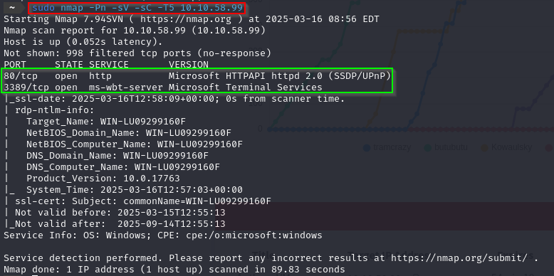

El resultado del escaneo nos muestra dos puertos abiertos:

- **80/TCP**: HTTP, alojado en un servidor web IIS.
- **3389/TCP**: RDP, utilizado para conexiones de escritorio remoto.

Con esta información, comenzamos a explorar el contenido del puerto **80**, que generalmente alberga sitios web.

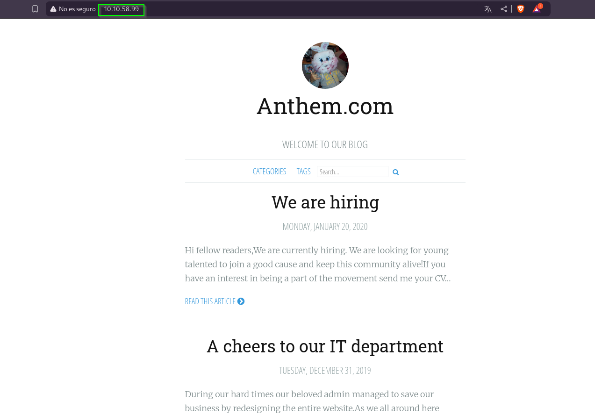

---

### Análisis del sitio web

Accedemos al sitio web y verificamos si existe un archivo `robots.txt`. Este archivo nos puede proporcionar pistas sobre rutas restringidas o información sensible. Al revisarlo, encontramos lo siguiente:

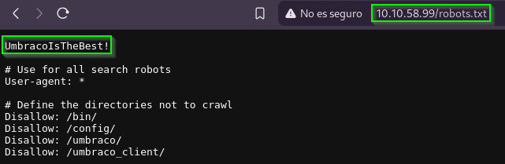

- Rutas bloqueadas que hacen referencia a **Umbraco**, un CMS conocido.
- Un texto interesante: `UmbracoIsTheBest!`, que podría ser una contraseña.

Con esta información, decidimos investigar la ruta `/umbraco/`, donde nos encontramos con una pantalla de inicio de sesión. Ya tenemos una posible contraseña, pero aún necesitamos un nombre de usuario.

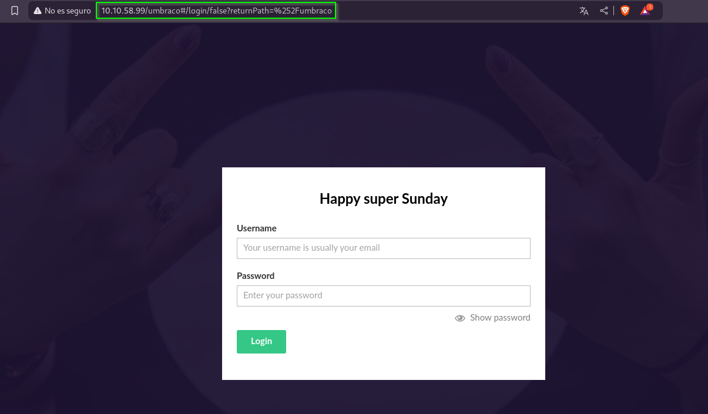

Explorando el blog del sitio web, encontramos un poema llamado **Solomon Grundy**. 

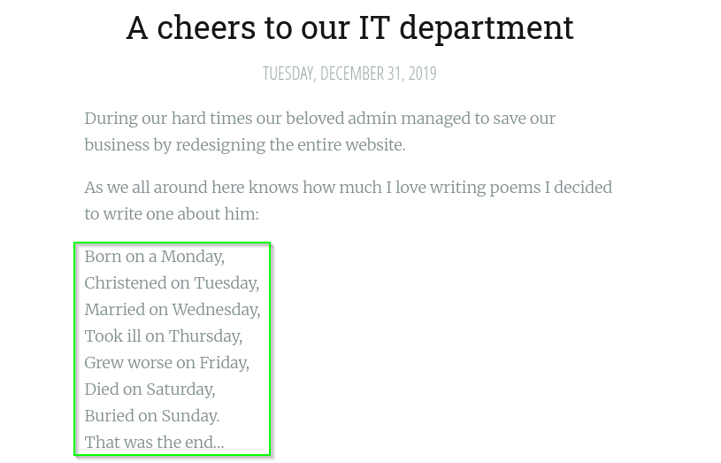

Además, identificamos el correo electrónico del administrador: **JD@anthem.com**. Siguiendo el formato de los correos, deducimos que el correo asociado a nuestro usuario es **SG@anthem.com**.

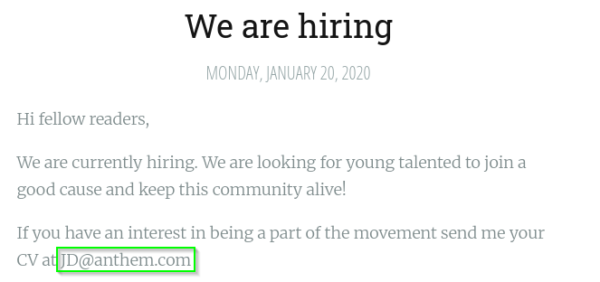

---

### Localización de las flags

Las flags están ocultas en diferentes partes del sitio web. Para encontrarlas, inspeccionamos los elementos y revisamos el código fuente de las páginas. Aquí están las ubicaciones y los textos de las flags:

1. **Primera bandera**  
   Ubicación: `/archive/we-are-hiring/`  
   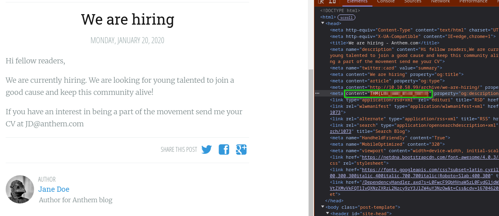

2. **Segunda bandera**  
   Ubicación: Página principal `/`  
   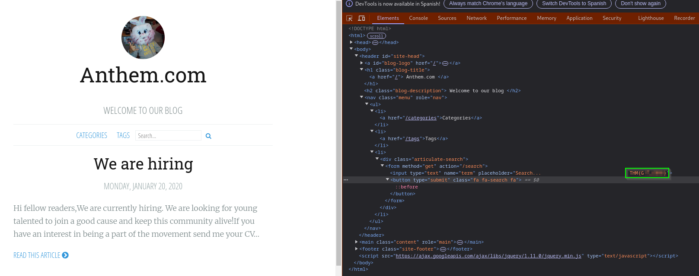

3. **Tercera bandera**  
   Ubicación: `/authors/jane-doe/`  
   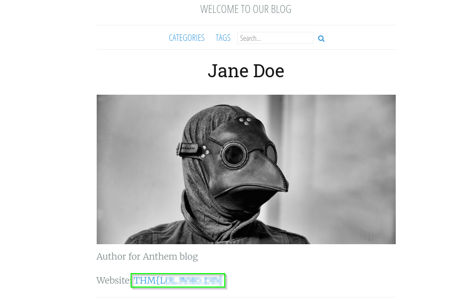

4. **Cuarta bandera**  
   Ubicación: `/archive/a-cheers-to-our-it-department/`  
   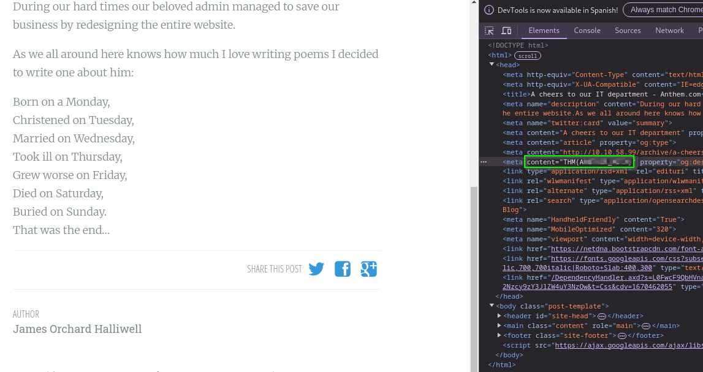

---

### Acceso mediante RDP

Con las credenciales obtenidas anteriormente:

```txt
Usuario: SG
Contraseña: UmbracoIsTheBest!
```

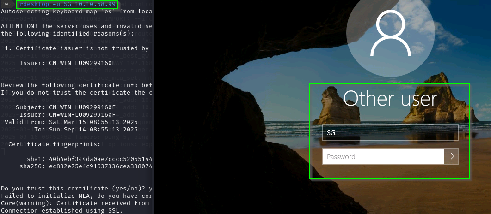

Intentamos conectarnos al puerto **3389** utilizando RDP para establecer una sesión remota. Una vez dentro, exploramos los archivos del usuario y encontramos el archivo `user.txt`, que contiene otra bandera.

---

Encontramos un fichero user.txt en el escritorio que contiene otra bandera:

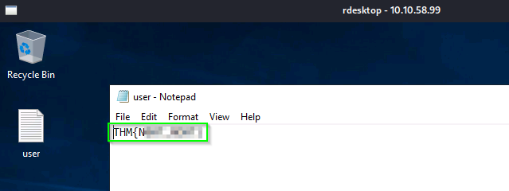


---

### Escalada de privilegios

Durante la exploración del sistema, descubrimos una carpeta llamada "Backup" en la unidad **C:** que parece contener información sensible.

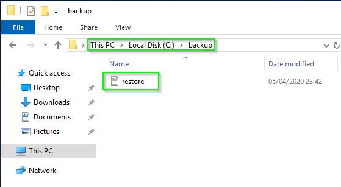

Sin embargo, al intentar acceder al archivo, nos damos cuenta de que no tenemos permisos suficientes.

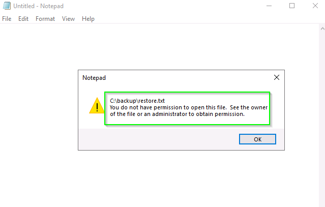

Procedemos a modificar los permisos del archivo siguiendo estos pasos:
1. Hacemos clic derecho sobre el archivo y seleccionamos **Propiedades**.
2. En la pestaña **Seguridad**, presionamos **Editar** para cambiar los permisos.
    
    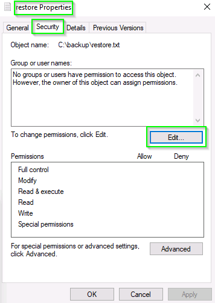

3. Añadimos nuestro usuario (`SG`) y validamos con **Comprobar nombres**.

    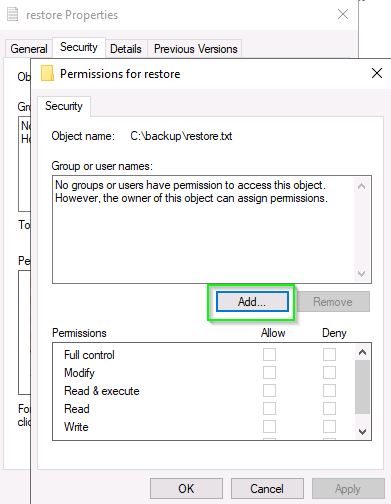
    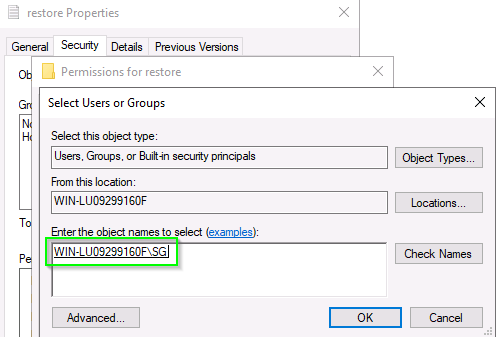
4. Aplicamos los cambios.

Una vez que modificamos los permisos, logramos acceder al archivo y encontramos la contraseña del usuario **Administrador**.

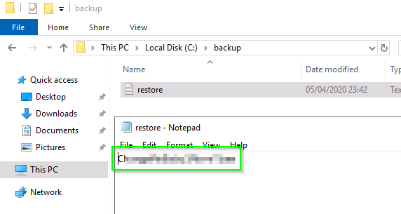

---

### Acceso como Administrador

Con la contraseña obtenida, iniciamos sesión como administrador en la máquina. En su escritorio encontramos el archivo `root.txt`, que contiene la última bandera.

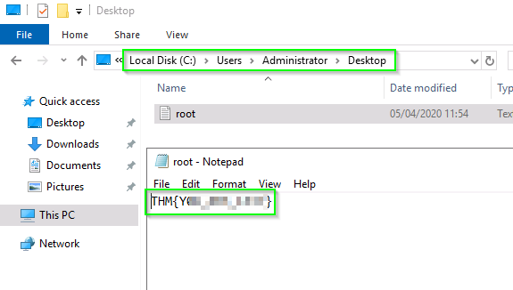

---

### ¡Máquina completada con éxito! 🎉