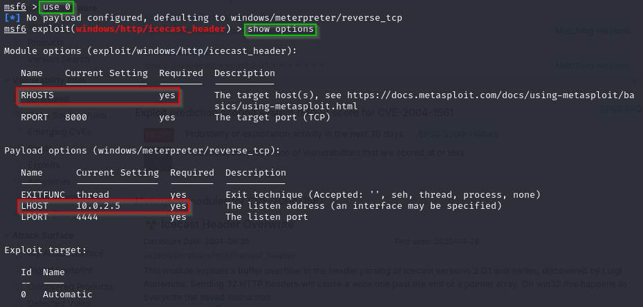

# Ice

## NMAP
El primer paso consiste en realizar un análisis de la máquina utilizando **Nmap**, con el objetivo de identificar los servicios que están en funcionamiento y posibles vectores de ataque.

Ejecutamos el escaneo con los siguientes parámetros:

- **`-A`** -> Habilita el escaneo detallado (detección de sistema operativo, versiones, scripts y traceroute).
- **`-T4`** -> Aumenta la velocidad del escaneo.

Los resultados muestran que el puerto **8000** está abierto y ejecutando **Icecast**.

---

Buscamos información sobre este servicio y encontramos que Icecast presenta una vulnerabilidad identificada como **CVE-2004-1561**.

Para confirmar la presencia de la vulnerabilidad, consultamos [CVEdetails](https://www.cvedetails.com/cve/CVE-2004-1561/), donde se describe cómo puede ser explotada.

---

Usaremos **Metasploit** para explotar la vulnerabilidad detectada.

Abrimos Metasploit con el siguiente comando `msfconsole`.

Buscamos exploits disponibles para **Icecast**:

---

Seleccionamos el exploit correspondiente y miramos las opciones:

Podemos comprobar que hay parámetros sin configurar por lo que les damos unos valores:

- **`RHOSTS`** -> IP_TryHackMe
- **`LHOST`** -> IP_VPN_Máquina 

---

Ejecutamos el ataque con el comando `run`:

---

Como podemos comprobar la explotación ha resultado exitosa. Para identificar el usuario usaremos el comando `getuid`. Para buscar información sobre el sistma usaremos el comando `sysinfo`:

Listamos los procesos con el comando `PS`:

Podemos ver como se está ejecutando el proceso **Icecast**.

---

Siguiendo las instrucciones del enunciado usamos el siguiente comando:

Donde encontramos el exploit `exploit/windows/local/bypassuac_eventvwr` que nos puede dar la opción de escalar privilegios.

---

Vamos a poner la sesión actual en segundo plano con el comando:

Con el comando `sessions` vemos que el ID de la sesión es 1, lo necesitaremos más adelante.

---

Vamos a usar el exploit que localizamos anteriormente y miramos las opciones:

Lo configuramos con nuestros parámetros:

- **`LHOST`** -> IP_VPN_Máquina
- **`SESSION`** -> Sesión identificada anteriormente

 

Ejecutamos el exploit:

---

Para ver los privilegios que tenemos usamos el siguiente comando:

Hemos encontrado el privilegio `SeTakeOwnershipPrivilege`, lo que demuestra que hemos logrado la escalada de privilegios.

---

Miramos los procesos en ejecución y migramos el proceso al proceso 1264 `spoolsv.exe`. Si usamos el comando `getuid` ahora comprobaremos como nuestro usuario ha cambiado:

Se puede comprobar que hemos obtenido el control total.

---

Cargamos la extensión Kiwi para extraer las credenciales:

Con esta herramienta obtenemos todas las credenciales almacenadas.

---

Para terminar vamos a usar una serie de comandos que son muy útiles para la **Post-explotación**:

- **Hashdump**: Extrae los hashes de las contraseñas almacenadas en el sistema.

    

- **Screenshare**: Captura y muestra en tiempo real la pantalla del usuario comprometido.

    

    

- **Record_mic**: Graba el audio del micrófono del sistema objetivo.

    

- **Timestomp**: Modifica las marcas de tiempo de los archivos para evadir detección forense.

    

- **Golden_ticket_create**: Genera un *Golden Ticket* para obtener acceso persistente en un dominio Windows.

    

---

### Podemos confirmar que la máquina ha sido comprometida con **¡ÉXITO!**