# Relevant

## Reconocimiento inicial

Para empezar, realizamos un escaneo de puertos en la máquina objetivo utilizando **Nmap**. Esto nos permitió identificar los servicios activos y posibles puntos de entrada.

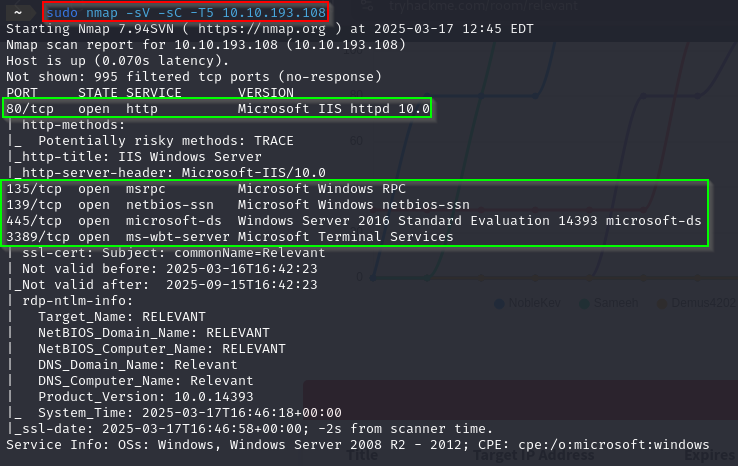

El resultado del escaneo reveló varios puertos abiertos, siendo los más relevantes:
- **445/TCP**: Servicio SMB.
- Otros puertos que, en este momento, no parecían útiles.

Decidimos profundizar en el puerto **445**, ejecutando scripts específicos como `smb-enum-shares.nse` y `smb-enum-users.nse`. Esto nos permitió enumerar recursos compartidos y usuarios disponibles.

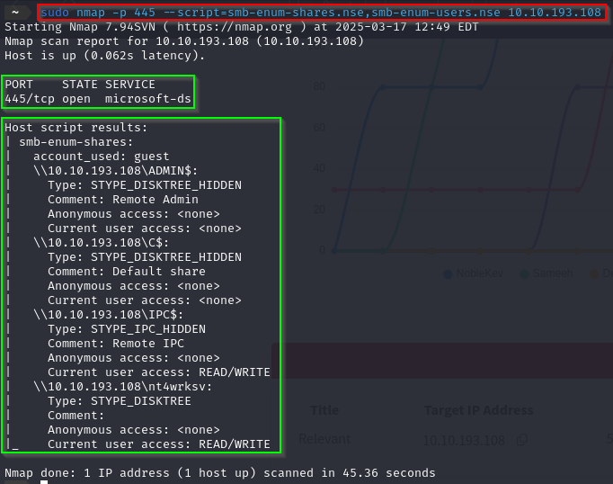

---

## Enumeración mediante enum4linux

Usamos la herramienta de linux `enum4linux` para poder recopilar información adicional sobre la configuración del sistema objetivo.

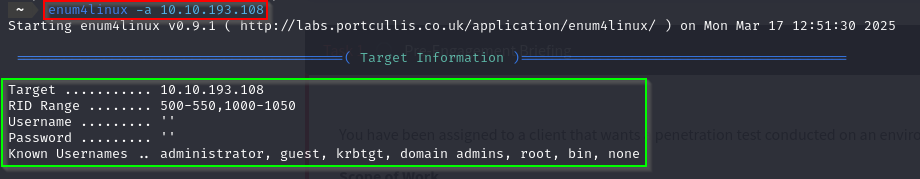

---

## Interacción con SMB

Una vez identificado el servicio SMB, interactuamos con él utilizando herramientas como `smbclient`. Durante esta exploración, encontramos un recurso compartido llamado `nt4wrksv`.

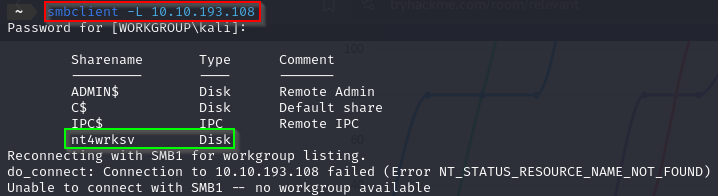


Este recurso permitía acceso anónimo.

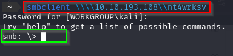


Dentro de este recurso, localizamos un archivo interesante llamado `password.txt`.

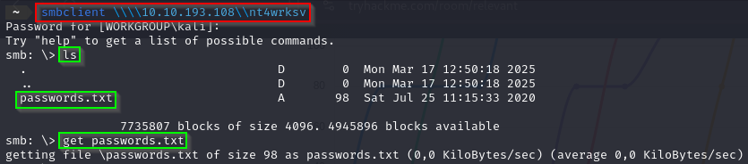


Encontramos el archivo y, al abrirlo, descubrimos que contenía credenciales codificadas en Base64. 

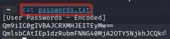

Para decodificarlas, utilizamos el siguiente comando:

```bash
echo "CREDENCIALES_EN_BASE64" | base64 -d
```

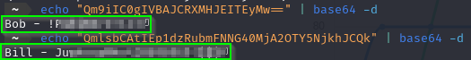

Esto nos proporcionó las credenciales necesarias para continuar avanzando.

---

## Acceso inicial

Con las credenciales obtenidas, generamos una reverse shell en formato **ASPX** utilizando `msfvenom`. El comando empleado fue:

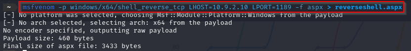

Subimos este archivo al recurso SMB y lo ejecutamos desde el servidor HTTP de la máquina objetivo. 

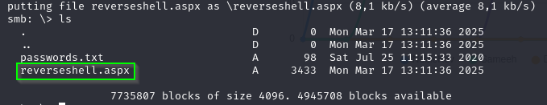

Esto nos permitió establecer acceso inicial al sistema.

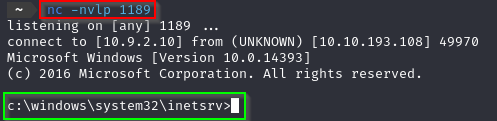

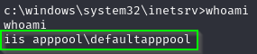

<br>

Ahora accederemos al escritorio del usuario Bob, donde encontraremos la primera flag:

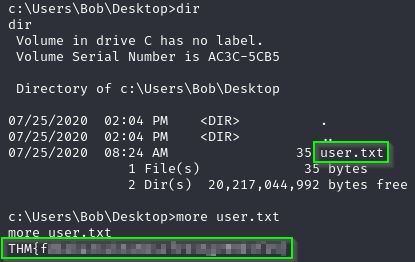

---

## Escalada de privilegios

Una vez dentro del sistema, verificamos los privilegios disponibles ejecutando:

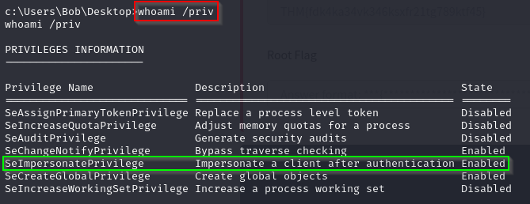

Identificamos que el privilegio `SeImpersonatePrivilege` estaba habilitado. Este privilegio es ideal para realizar una escalada de privilegios utilizando el exploit **PrintSpoofer**.

---

### Uso de PrintSpoofer

1. Clonamos el repositorio del exploit en nuestra máquina local:

   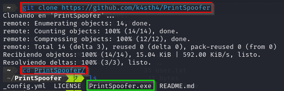

2. Compilamos el ejecutable y lo subimos al servidor objetivo mediante `smbclient`.

3. Ejecutamos el exploit en la máquina comprometida con el siguiente comando:

   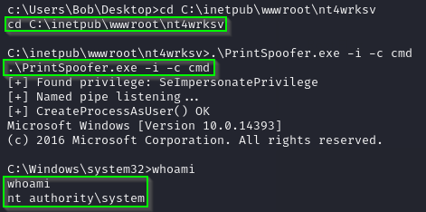

   Esto nos otorgó acceso como **NT AUTHORITY\SYSTEM**, lo que representa el nivel más alto de privilegios en un sistema Windows.

---

Ahora tan solo bastaría con acceder al escritorio del usuario administrador y obtener la segunda flag:

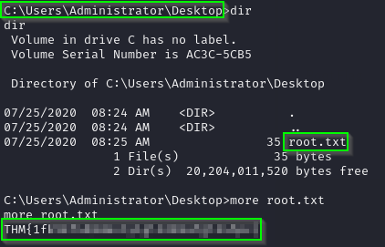

---

### Máquina completada con éxito! 🎉