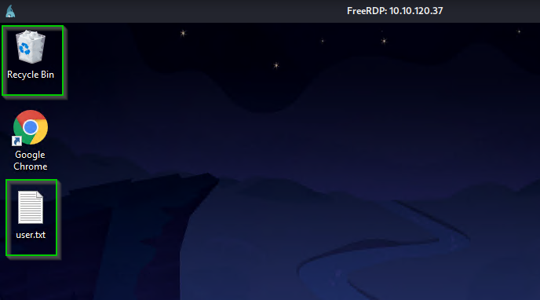

# Retro

## NMAP
Lo primero será realizar un escaneo de puertos con NMAP utilizando el parámetro `-Pn`, ya que la máquina no responde a pings:


En el escaneo se identifican dos puertos abiertos:
- **80**: Servidor HTTP Microsoft IIS.
- **3389**: Servicio de RDP.

Al analizar el puerto 80, lo primero que encontramos es el index por defecto de Microsoft IIS.


---

## Enumeración Web
Accedemos al servidor web en el puerto 80 y encontramos la página por defecto de Microsoft IIS. Esto indica que debemos buscar directorios ocultos.

Utilizamos `gobuster` para realizar un fuzzing de directorios:


Esto revela el directorio `/retro`. Al acceder, encontramos un blog personal de Wade con contenido sobre videojuegos y películas.


---

### Credenciales
En uno de los posts sobre *Ready Player One*, se menciona que Wade suele cometer errores al escribir el nombre de su avatar.


Revisamos los comentarios y encontramos una contraseña: **parzival**.


Con las siguientes credenciales:
- **Usuario:** Wade
- **Contraseña:** parzival

Procedemos a conectarnos vía RDP.

---

## Acceso RDP
Usamos `xfreerdp` para conectarnos al sistema:

```bash
xfreerdp /u:wade /p:parzival /v:IP_MAQUINA
```




Una vez dentro, encontramos el archivo `user.txt` en el escritorio de Wade. Este contiene la primera flag.


---

## Escalada de Privilegios
En la papelera de reciclaje encontramos un ejecutable llamado `hhupd.exe`. Este archivo está vinculado a la vulnerabilidad **CVE-2019-1388**, que permite abrir Internet Explorer con privilegios elevados. Además en el navegador `Google Chrome` encontramos más información relacionada con este CVE y con el blog de Retro.


---

### Explotación CVE-2019-1388
1. Restauramos y ejecutamos `hhupd.exe` como administrador.
2. En la ventana emergente, seleccionamos "Mostrar más detalles" y accedemos al enlace del certificado del editor.

3. Nos pide seleccionar una aplicación para poder abrir el enlace y debido a un Bug no nos deja por lo que buscamos otra alternativa.


---

### Alternativa: CVE-2017-0213
Para superar el problema, utilizamos la vulnerabilidad **CVE-2017-0213**, que permite escalar privilegios mediante un exploit específico.


Descargamos el exploit desde [este repositorio](https://github.com/WindowsExploits/Exploits/tree/master/CVE-2017-0213). Como no nos deja descargarlo directamente clonamos el repositorio en nuestra máquina Kali:


Descomprimimos el zip y obtenemos el ejecutable `x64`:


Montamos un servidor con python3 en nuestro kali, y asi descargamos el ejecutable desde la máquina windows.


Ejecutamos el exploit y obtenemos acceso como administrador.


---

## Root Flag
Finalmente, navegamos por los directorios del sistema como administrador y encontramos el archivo `root.txt`, completando así la explotación de la máquina Retro.


---

### ¡Máquina completada con éxito! 🎉
