# WriteUp: Tech_Support01

## Reconocimiento

Iniciamos el análisis con un escaneo de puertos utilizando `nmap` para identificar los servicios activos en la máquina. Ejecutamos el siguiente comando:

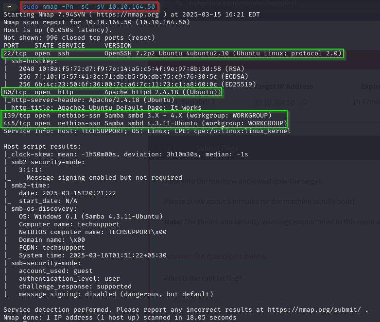

Los resultados mostraron los siguientes puertos abiertos:
- **22**: SSH
- **80**: HTTP
- **139** y **445**: SMB

Al observar que SMB estaba habilitado, utilizamos el script `smb-enum-shares` de Nmap para enumerar los recursos compartidos:

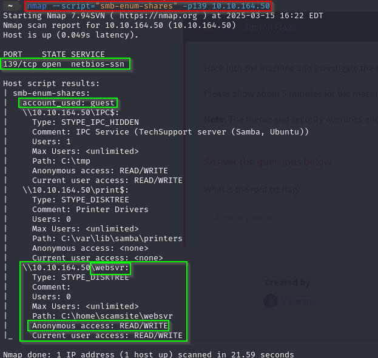

Esto reveló un directorio llamado **websvr**, accesible de manera anónima con permisos de lectura y escritura. Para acceder al recurso, establecimos una conexión anónima:

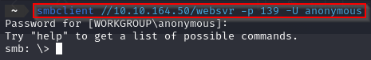

Dentro del directorio encontramos un archivo llamado `enter.txt`. Lo descargamos y revisamos su contenido:

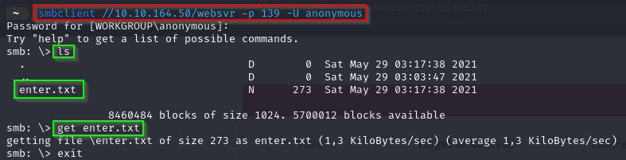

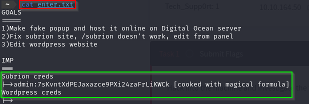
El archivo contenía credenciales codificadas y mencionaba dos sitios web alojados en el servidor: uno basado en **WordPress** y otro en **Subrion CMS**.

---

## Acceso al CMS Subrion

Con las credenciales obtenidas en `enter.txt`, procedimos a descifrarlas utilizando la herramienta **CyberChef** con la operación "Magic". Esto nos permitió obtener las siguientes credenciales:

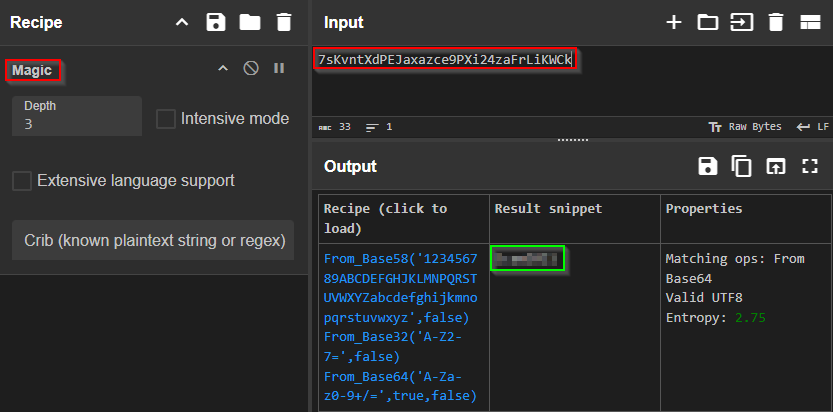

- **Usuario:** admin  
- **Contraseña:** ...... 

Accedimos al portal del CMS Subrion y nos autenticamos con éxito.

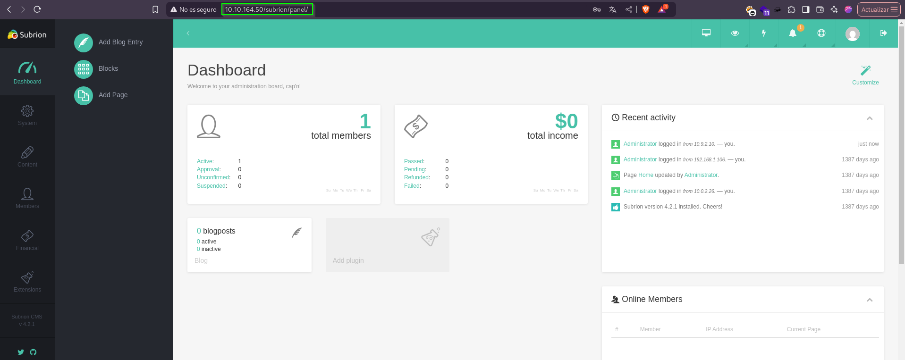

Una vez dentro del panel de administración, identificamos una funcionalidad para subir archivos. También verificamos que la versión del CMS era **4.2.1**, lo que nos llevó a buscar vulnerabilidades específicas para esta versión.

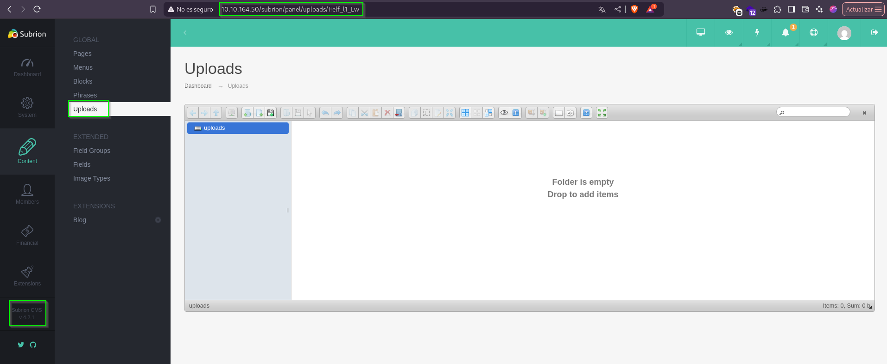

En [Exploit-DB](https://www.exploit-db.com/) encontramos un exploit que permitía la carga de archivos maliciosos (`.phar` o `.pht`). Descargamos una reverse shell en PHP desde PentestMonkey y configuramos nuestra IP y puerto:

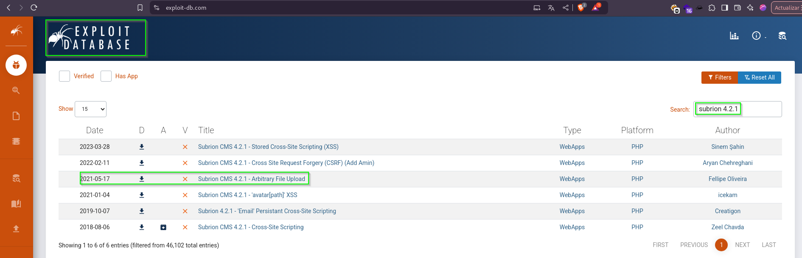

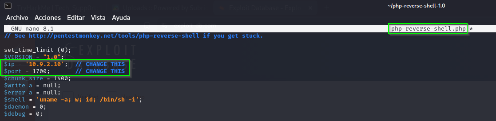

Renombramos el archivo para evadir restricciones:

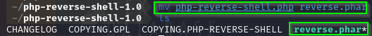

Subimos el archivo al CMS y accedimos a su ubicación en el navegador, activando la reverse shell.

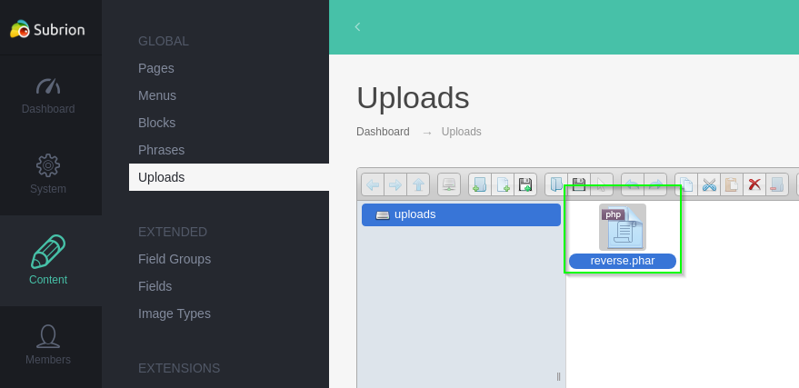

 Para escuchar la conexión, usamos:

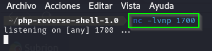

---

Como este método no funcionó, usamos la otra posibilidad, para ello buscaremos un exploit específico para la versión del CMS en uso. Localizamos un exploit en Python:

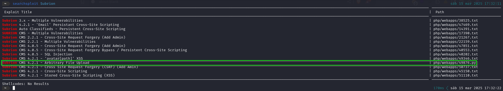

Lo descargamos y extraemos en nuestro sistema:

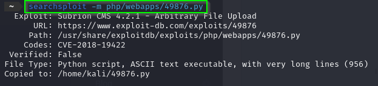

Lo ejecutamos consiguiendo acceso al sistema:

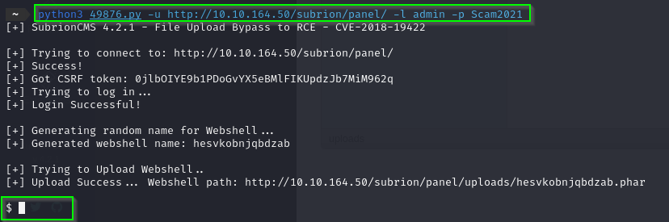

---

## Exploración del servidor

Durante la exploración del sistema, encontramos el archivo `wp-config.php` dentro del sitio WordPress. Este archivo contenía credenciales adicionales:

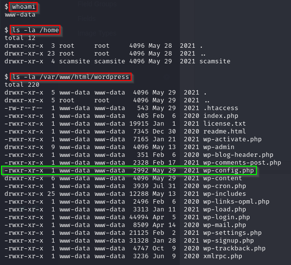

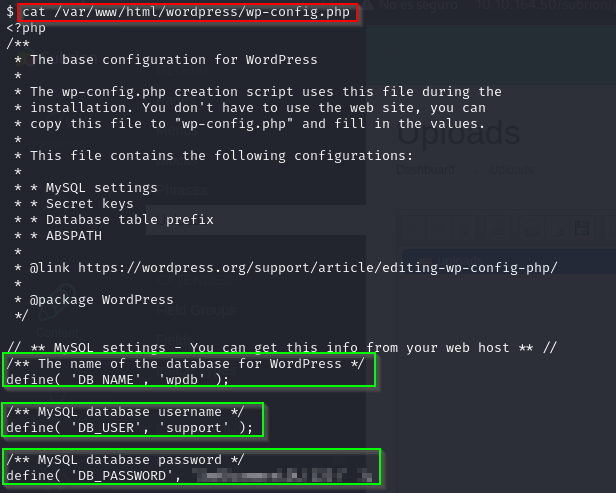

Con estas credenciales intentamos conectarnos vía SSH al usuario `scamsite`, identificado en `/etc/passwd`.

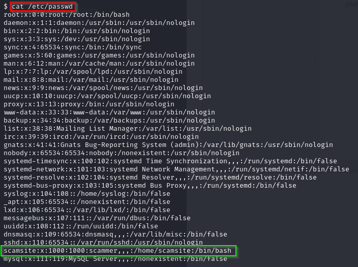

---

## Escalada de privilegios

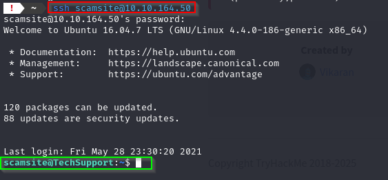

Tras iniciar sesión como `scamsite`, enumeramos los comandos que este usuario podía ejecutar con permisos elevados:

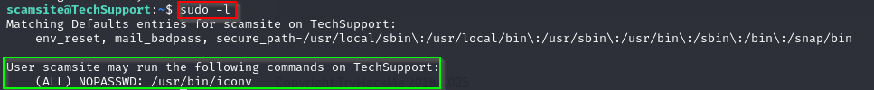

Descubrimos que el binario **iconv** podía ejecutarse como root. Consultamos [GTFOBins](https://gtfobins.github.io/) y verificamos que este binario podía explotarse para leer archivos restringidos.

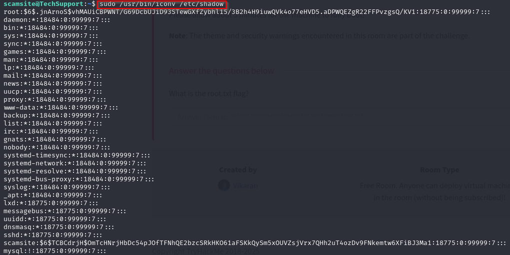

Ejecutamos el siguiente comando para leer el archivo `root.txt` y obtener la flag final:

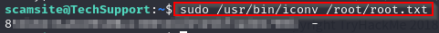

---

### ¡Máquina completada con éxito! 🎉